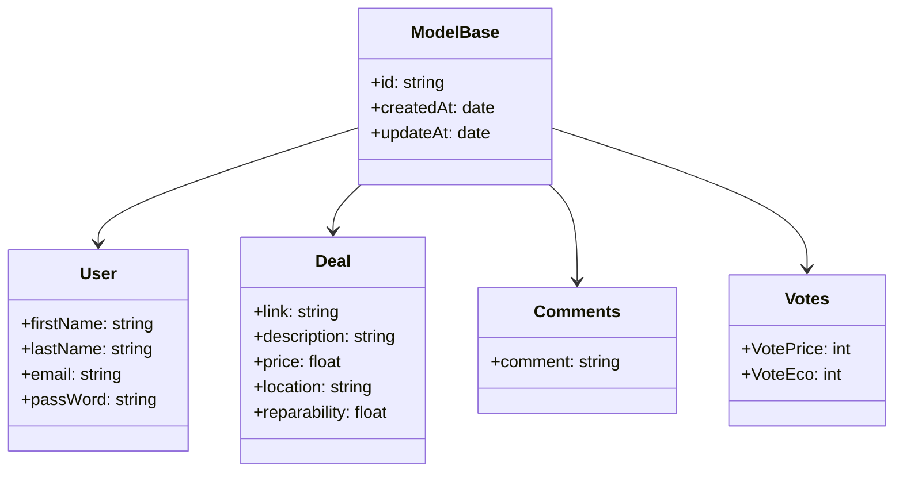

```mermaid

classDiagram

		class ModelBase {
			+id: string
			+createdAt: date
			+updateAt: date
		}

		class User {
			+firstName: string
			+lastName: string
			+email: string
			+passWord: string
		}

		class Deal {
			+link: string
			+description: string
			+price: float
			+location: string
			+reparability: float

		}

		class Comments {
			+comment: string

		}

		class Votes {
			+VotePrice: int
			+VoteEco: int
		}


	ModelBase --> User
	ModelBase --> Deal
	ModelBase --> Comments
	ModelBase --> Votes


```
